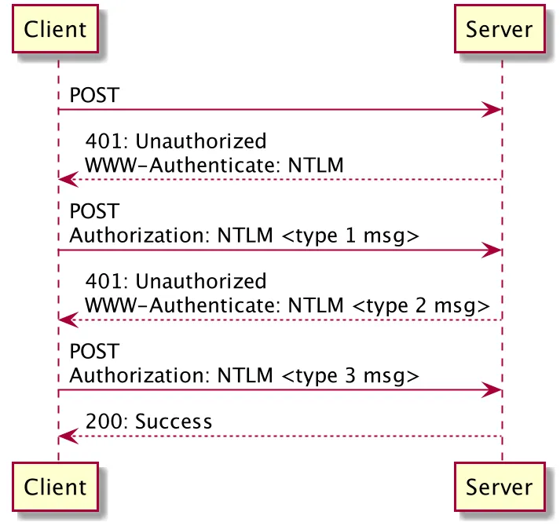

## References

NTLM specification:  
https://docs.microsoft.com/en-us/openspecs/windows_protocols/ms-nlmp/b38c36ed-2804-4868-a9ff-8dd3182128e4

A more understandable document describing NTLM:  
http://davenport.sourceforge.net/ntlm.html

NTLM Authentication Scheme for HTTP:  
https://web.archive.org/web/20200724074947/https://www.innovation.ch/personal/ronald/ntlm.html

**NTLM-Authorisation**

