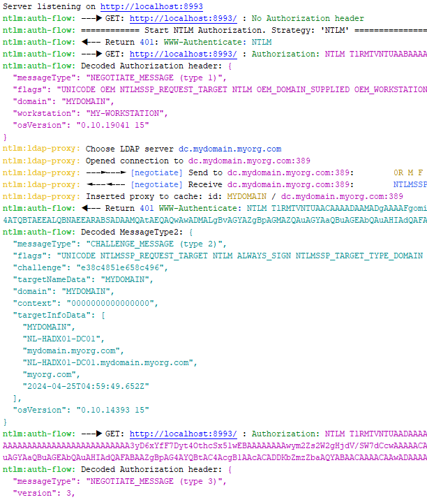

[](https://www.npmjs.com/package/ya-express-ntlm)

# ya-express-ntlm

An express middleware to have basic NTLM-authentication in node.js.


Based on 
- [express-ntlm](https://www.npmjs.com/package/express-ntlm)
- [@node-ntlm/core](https://www.npmjs.com/package/@node-ntlm/core)
- [ntlm-parser](https://www.npmjs.com/package/ntlm-parser)


## install

```shell
npm install ya-express-ntlm
```


## Usage example


#### JS

```js
const dotenv = require('dotenv');

dotenv.config();
const express = require('express');
const { authNTLM } = require('ya-express-ntlm');

process.env.DEBUG = 'ntlm:auth-flow,ntlm:ldap-proxy,ntlm:ldap-proxy-id';

const app = express();
const port = Number(process.env.TEST_PORT) || 8080;

app.use(authNTLM({
  getStrategy: () => 'NTLM',
  getDomain: () => process.env.DOMAIN || 'MYDOMAIN',
  getDomainControllers: () => [process.env.LDAP_ADDRESS || 'ldap://dc.mydomain.myorg.com'],
}));

app.all('*', (req, res) => {
  res.end(JSON.stringify({ ts: Date.now(), ...req.ntlm }));
  // {"domain": "MYDOMAIN", "username": "MYUSER", "workstation": "MYWORKSTATION"}
});

app.listen(port);

console.log(`Server listening on http://localhost:${port}`);
```


#### TypeScript

```typescript
import * as dotenv from 'dotenv';
import express, { Request, Response } from 'express';

dotenv.config();
process.env.DEBUG = 'ntlm:auth-flow,ntlm:ldap-proxy,ntlm:ldap-proxy-id';

import { authNTLM, EAuthStrategy } from 'ya-express-ntlm';

const app: express.Express = express();
const port = Number(process.env.TEST_PORT) || 8080;

app.use(authNTLM({
  getStrategy: () => EAuthStrategy.NTLM,
  getDomain: () => process.env.DOMAIN || 'MYDOMAIN',
  getDomainControllers: () => [process.env.LDAP_ADDRESS || 'ldap://dc.mydomain.myorg.com'],
}));

app.all('*', (req: Request, res: Response) => {
  res.end(JSON.stringify({ ts: Date.now(), ...req.ntlm }));
  // {"domain": "MYDOMAIN", "username": "MYUSER", "workstation": "MYWORKSTATION"}
});

app.listen(port);

console.log(`Server listening on http://localhost:${port}`);
```

To use the `req.ntlm` object in your TypeScript project, add the file `express-augmented.d.ts`

```typescript
declare global {
  namespace Express {
    export interface Request {
      ntlm: {
        username?: string,
        domain?: string,
        workstation?: string,
        isAuthenticated?: boolean,
        uri?: string,
      },
    }
  }
}
```


## Without validation

It's not recommended, but it's possible to add NTLM-Authentication without 
validation. This means you can authenticate without providing valid credentials.

```js
app.use(authNTLM({
  getStrategy: () => 'NTLM_STUB',
  getDomain: () => process.env.DOMAIN || 'MYDOMAIN',
}));
```


## Options

All parameters are optional functions [listed here](https://github.com/Bazilio-san/ya-express-ntlm/blob/master/src/interfaces.ts#L40)     


Default values are [here](https://github.com/Bazilio-san/ya-express-ntlm/blob/master/src/prepare-options.ts#L7).


## Debugging

You can view the entire authorization process in detail.
To enable debug mode, you need to set ENV `DEBUG`

```shell
DEBUG=ntlm:auth-flow,ntlm:ldap-proxy,ntlm:ldap-proxy-id
```




## Notes

All NTLM-fields (`username`, `domain`, `workstation`) are also available within
`response.locals.ntlm`, which means you can access it through your template 
engine (e.g. jade or ejs) while rendering (e.g. `<%= ntlm.username %>`).


## References

NTLM specification:  
https://docs.microsoft.com/en-us/openspecs/windows_protocols/ms-nlmp/b38c36ed-2804-4868-a9ff-8dd3182128e4

A more understandable document describing NTLM:  
http://davenport.sourceforge.net/ntlm.html

NTLM Authentication Scheme for HTTP:  
https://web.archive.org/web/20200724074947/https://www.innovation.ch/personal/ronald/ntlm.html


**Typical NTLM handshake looks like this**


